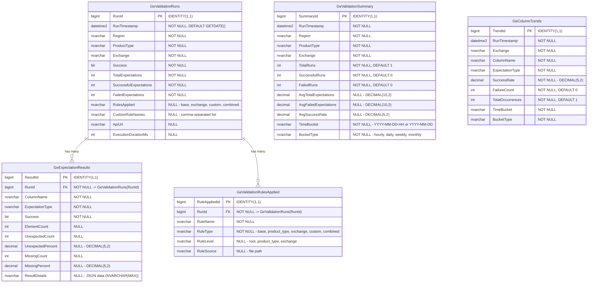

# Database ER Diagram - Generator Project

## Entity-Relationship Diagram

## Relationships

### One-to-Many Relationships

1. **GeValidationRuns → GeExpectationResults**
   - One validation run can have many expectation results
   - Foreign Key: `GeExpectationResults.RunId` → `GeValidationRuns.RunId`
   - Cascade Delete: ON DELETE CASCADE

2. **GeValidationRuns → GeValidationRulesApplied**
   - One validation run can have many rules applied
   - Foreign Key: `GeValidationRulesApplied.RunId` → `GeValidationRuns.RunId`
   - Cascade Delete: ON DELETE CASCADE

### Independent Tables

3. **GeValidationSummary**
   - Denormalized summary table for quick trend analysis
   - No foreign key relationships
   - Pre-aggregated data by time buckets

4. **GeColumnTrends**
   - Tracks column-level trends over time
   - No foreign key relationships
   - Independent trend analysis table

## Key Indexes

### GeValidationRuns
- `idx_RunTimestamp` - On `RunTimestamp`
- `idx_RegionExchange` - On `Region`, `Exchange`
- `idx_ProductType` - On `ProductType`
- `idx_Exchange` - On `Exchange`
- `idx_Success` - On `Success`
- `idx_RegionTimestamp` - On `Region`, `RunTimestamp`
- `idx_ExchangeTimestamp` - On `Exchange`, `RunTimestamp`

### GeExpectationResults
- `idx_RunId` - On `RunId` (FK)
- `idx_ColumnName` - On `ColumnName`
- `idx_ExpectationType` - On `ExpectationType`
- `idx_Success` - On `Success`
- `idx_ColumnExpectation` - On `ColumnName`, `ExpectationType`
- `idx_RunSuccess` - On `RunId`, `Success`

### GeValidationRulesApplied
- `idx_RunId` - On `RunId` (FK)
- `idx_RuleName` - On `RuleName`
- `idx_RuleType` - On `RuleType`
- `idx_RuleLevel` - On `RuleLevel`
- `idx_RunRuleType` - On `RunId`, `RuleType`

### GeValidationSummary
- `idx_TimeBucket` - On `TimeBucket`
- `idx_RegionExchangeBucket` - On `Region`, `Exchange`, `TimeBucket`
- `idx_ExchangeBucket` - On `Exchange`, `TimeBucket`
- `idx_BucketType` - On `BucketType`
- `idx_Timestamp` - On `RunTimestamp`

### GeColumnTrends
- `idx_ExchangeColumn` - On `Exchange`, `ColumnName`
- `idx_ColumnExpectation` - On `ColumnName`, `ExpectationType`
- `idx_TimeBucket` - On `TimeBucket`
- `idx_ExchangeBucket` - On `Exchange`, `TimeBucket`

## Database Views

The schema also includes several views for common queries:

1. **v_latest_validations** - Latest validation results per exchange (last 24 hours)
2. **v_exchange_success_rates** - Exchange success rates over time
3. **v_column_failure_trends** - Column failure trends by date
4. **v_rule_effectiveness** - Rule effectiveness analysis

## Notes

- **Database**: RubyUsers (SQL Server)
- **Cascade Delete**: Both child tables (`GeExpectationResults` and `GeValidationRulesApplied`) have CASCADE DELETE, meaning deleting a validation run will automatically delete all related expectation results and rules applied.
- **JSON Storage**: `GeExpectationResults.ResultDetails` stores JSON data as `NVARCHAR(MAX)` for flexibility.
- **Time Buckets**: `GeValidationSummary` and `GeColumnTrends` use time buckets for efficient trend analysis.
- **Denormalization**: `GeValidationSummary` is a denormalized table for faster queries without joins.

